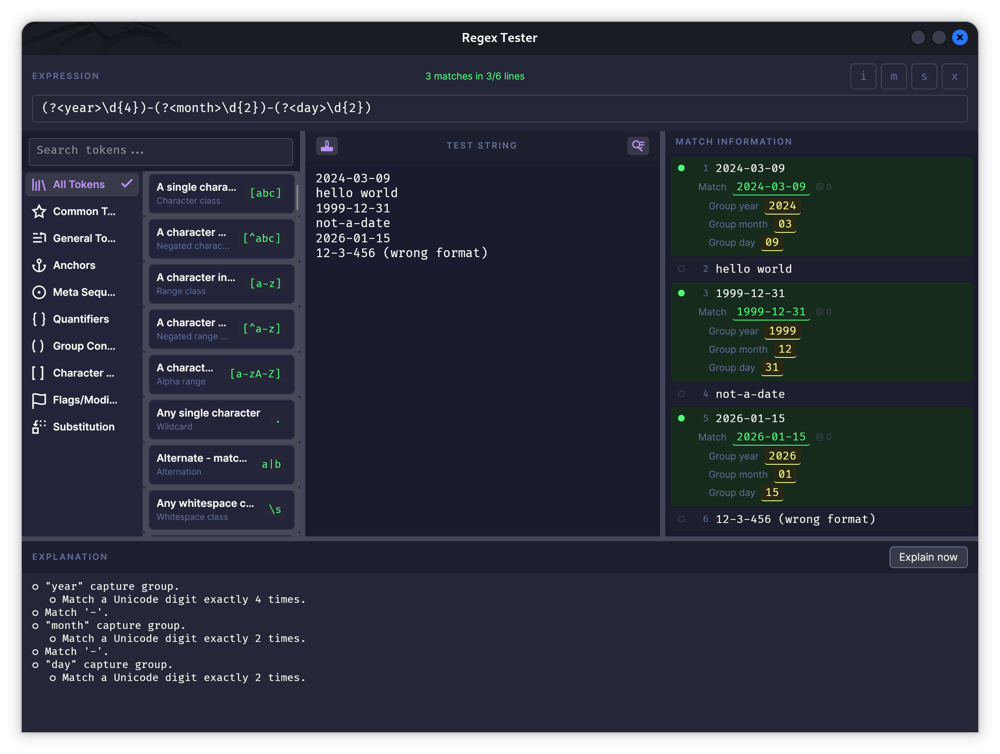

Standalone offline regex tester with explanation

> CAUTION: project is fully generated by an agent, unverified and might contain broken or even dangerous code - use at your own risk

## License

This project is licensed under the [MIT License](LICENSE).

## Contributing

Contributions are welcome! Please note that by submitting a pull request you
agree to our [Contributor License Agreement](CLA.md).